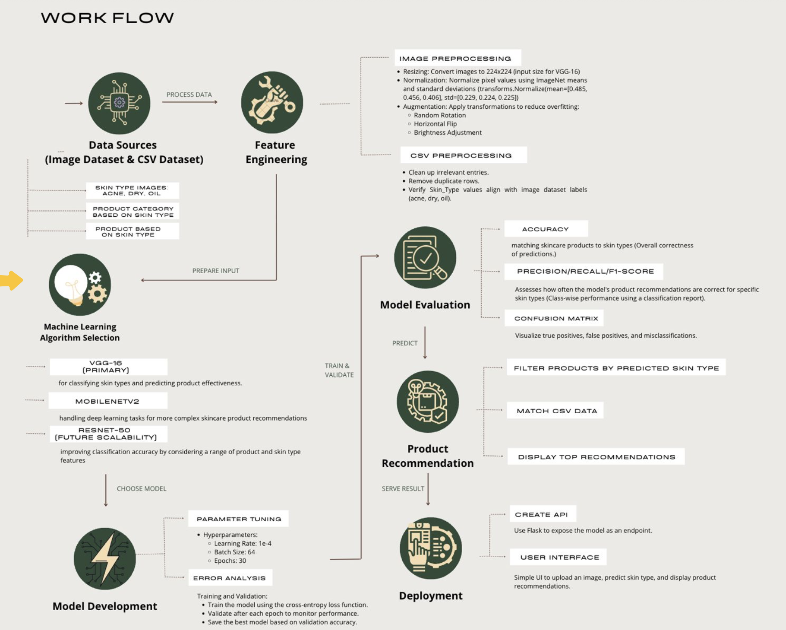
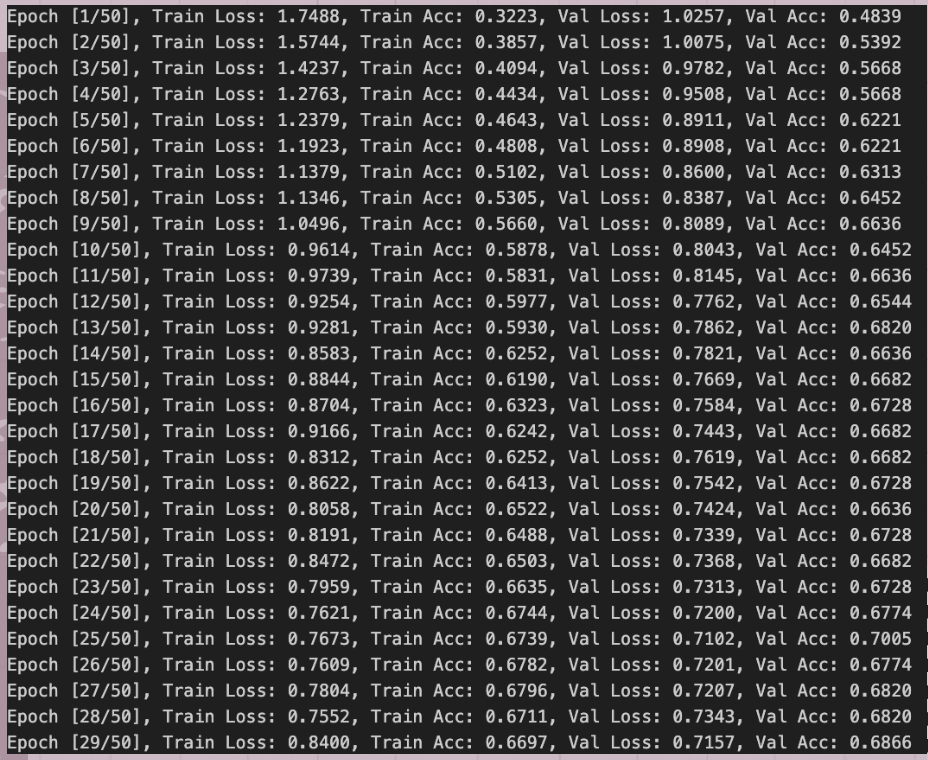
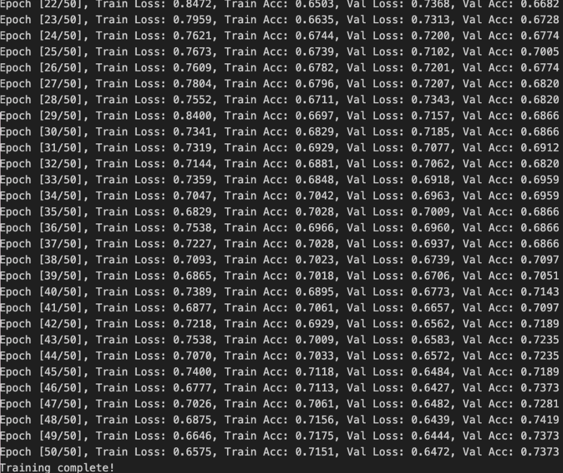
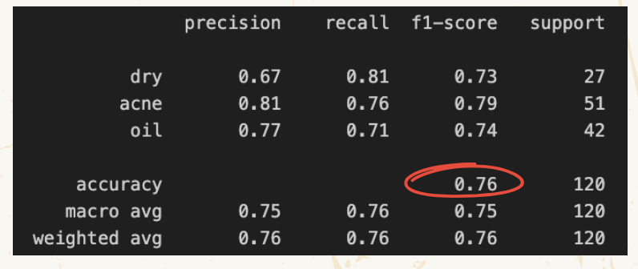
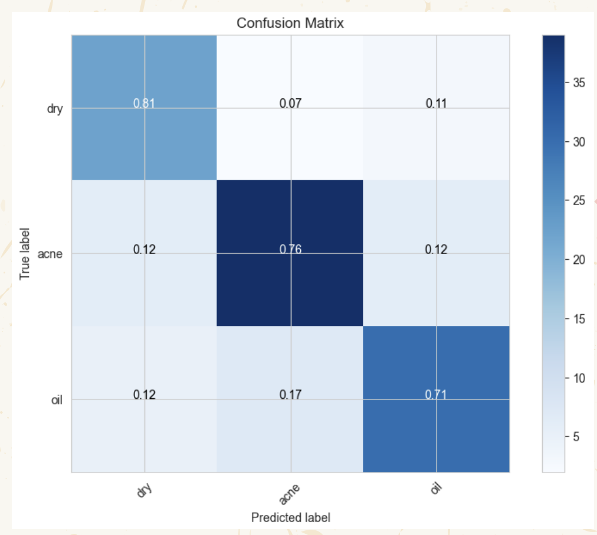

# GlowGlow - AI Skincare Recommendation System

**GlowGlow** is an AI-powered personal skincare assistant that predicts the effectiveness of skincare products based on your skin type and concerns. Built using **Convolutional Neural Networks (CNNs)** with architectures like **VGG-16, MobileNetV2, and ResNet-50**, GlowGlow removes guesswork from skincare routines and provides personalized, accurate recommendations.

---

## 📦 Pre-trained Model

GlowGlow requires the **VGG16 pre-trained model** (`VGG16_model.pth`) to run. 

### Steps to Download:

1. Download the model from Google Drive:  
[Download VGG16_model.pth](https://drive.google.com/file/d/1OnSmjtCE-KyF7SZLCPmQ7cTOCM3xo29P/view?usp=share_link)

2. Place the downloaded file **directly in the project root** (same folder as `app.py`).  

Once this is done, you can run the Flask app locally—no additional folders are needed.

---

## 🌟 About GlowGlow

GlowGlow helps users choose the right skincare products tailored to their skin type and concerns. It leverages AI and large-scale data analysis to predict product effectiveness, reducing product waste and saving time and money for users. This initiative supports **Sustainable Development Goal (SDG) 3**: Good Health and Well-being.

---

## 🔬 Methodology

GlowGlow uses **CNN architectures** to analyze skin type and product effectiveness:

* **VGG-16:** Primary model, simple yet powerful for image classification.
* **MobileNetV2:** Lightweight and efficient, optimized for mobile and edge devices.
* **ResNet-50:** Handles deep networks, capturing complex features for future scalability.

**Data Sources:**

* Skin images categorized as acne-prone, dry, or oily (from Kaggle and public datasets)
* Product information including category, brand, active ingredients, and user reviews

**Feature Engineering:**

* Image resizing to 224x224 pixels, normalization, and augmentation
* CSV feature extraction for skin type, product category, brand, and website/store link
* Encoding and normalization for model training and matching

**Model Training:**

* Pre-trained weights from ImageNet
* Dropout and regularization to prevent overfitting
* Trained over 30 epochs using Adam optimizer with learning rate 1e-4

---

## 🖥️ Website Workflow

GlowGlow web application workflow:



---

## 📊 Model Evaluation

GlowGlow’s CNN models were evaluated with key metrics:

### Training Progress Report




### Classification Report



### Confusion Matrix



**Sample Performance (VGG-16):**

* **Accuracy:** 76%
* **F1-Score:** 0.73–0.79 across classes (Acne, Dry, Oily)
* **Recall:**

  * Dry: 81% (11% misclassified as Oily)
  * Acne: 76% (minor misclassification as Dry or Oily)
  * Oily: 71% (17% misclassified as Acne)

---

## 🚀 Running Locally

### 1. Install the Required Libraries

```bash
pip install torch torchvision flask pillow pandas scikit-learn matplotlib seaborn tqdm
```

### 2. Verify Installation

```bash
python -c "import torch; import torchvision; import flask; import PIL; import pandas; import sklearn; import matplotlib; import seaborn; import tqdm; print('All libraries installed successfully!')"
```

### 3. Run the Flask App

1. Ensure `app.py` contains your Flask application code.
2. Open the terminal in the directory where `app.py` is located.
3. Start the Flask app:

```bash
python app.py
```

4. If successful, you will see:

```
Running on http://127.0.0.1:5000/ (Press CTRL+C to quit)
```

### 4. Access the Flask App

* Open a web browser and visit: [http://127.0.0.1:5000/](http://127.0.0.1:5000/)

---

## 📜 License

This project is licensed under the **MIT License**. You are free to use, modify, and distribute the code, but must include the same license in derivative works.

